<p align="center">
  
</p>

<h1 align="center">后生</h1>

<p align="center">
  <b>帮爸妈看一眼手机里的通知。</b><br>
  中文 Android 信息流助手。通知在本机处理，筛选规则由本人决定。
</p>

<p align="center">
  <a href="https://github.com/PathGao/housheng/releases"></a>
  <a href="https://github.com/PathGao/housheng/actions/workflows/ci.yml"></a>
  
  
</p>

<p align="center">
  <a href="#安装">安装</a> ·
  <a href="#能做什么">功能</a> ·
  <a href="#隐私">隐私</a> ·
  <a href="docs/roadmap.md">路线图</a> ·
  <a href="#参与开发">参与开发</a>
</p>

<p align="center">
  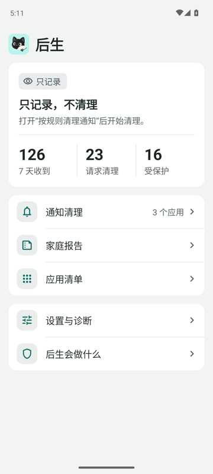
  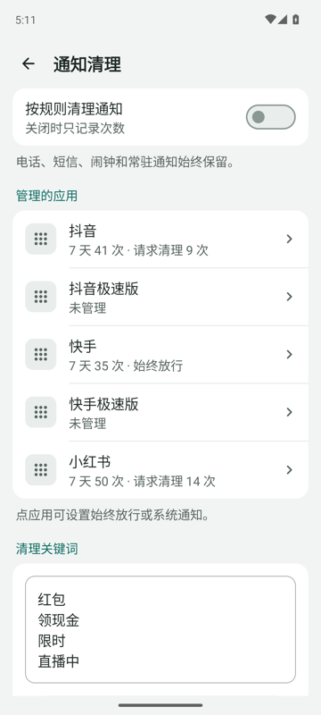
  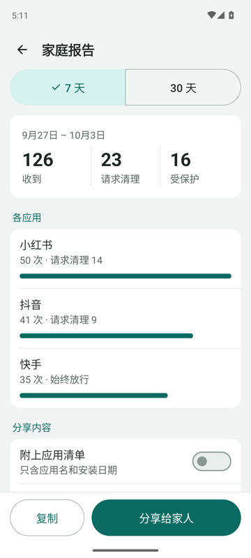
  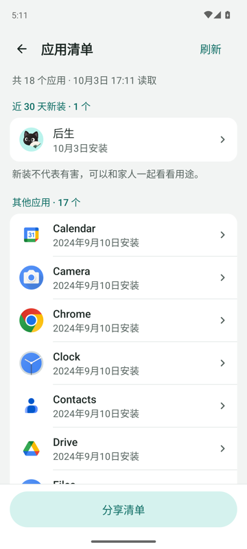
</p>

爸妈的手机每天响几十次，哪些是推广、哪些是正事，他们分不清，你又不在身边。后生先帮你们**看清**通知从哪来、有多频繁，再由爸妈自己决定清理什么。现在孩子只看报告、给建议，不远程控制。

## 能做什么

### 一眼看清现在怎样

首页最上方是状态面板，只用四个词：**未授权**、**已断开**、**只记录**、**清理中**。每个状态同时有图标、文字和底色，需要动手时才出现按钮。下面是最近 7 天收到、请求清理和受保护的次数。想马上停下，点“暂停自动清理”，记录保留。

<p align="center">
  
  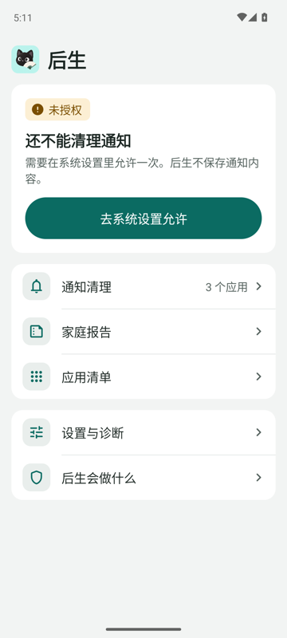
</p>

### 按应用管理，按关键词清理

勾选要管理的应用，每个应用显示最近 7 天的次数。点应用可以设为始终放行，或跳到系统通知设置。清理规则是自己填的关键词，电话、短信、闹钟和常驻通知始终保留。

<p align="center">
  
  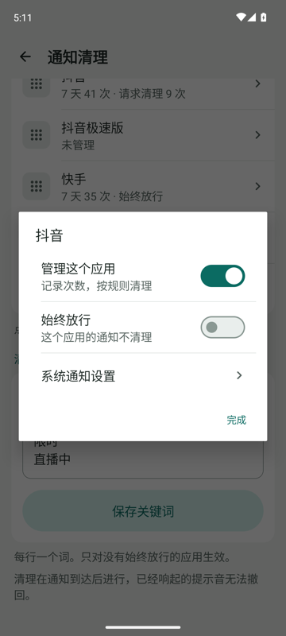
  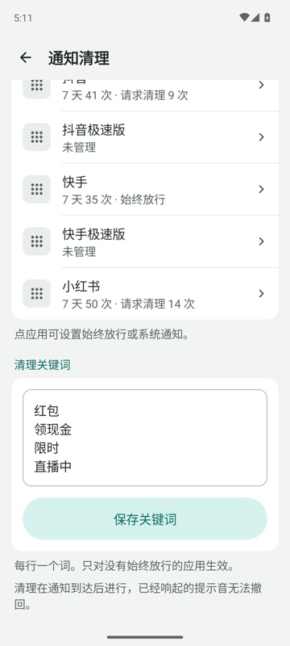
</p>

### 家庭报告

选最近 7 天或 30 天，看各应用的次数。报告先在手机上预览，再由爸妈自己复制或分享给家人，孩子据此建议怎么调。

<p align="center">
  
  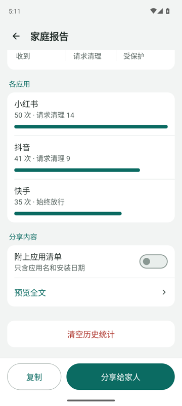
</p>

### 手机里装了什么

主动读取有桌面入口的应用，近 30 天新装的单独列出。点应用可打开系统详情，卸载与否由本人决定。

<p align="center">
  
  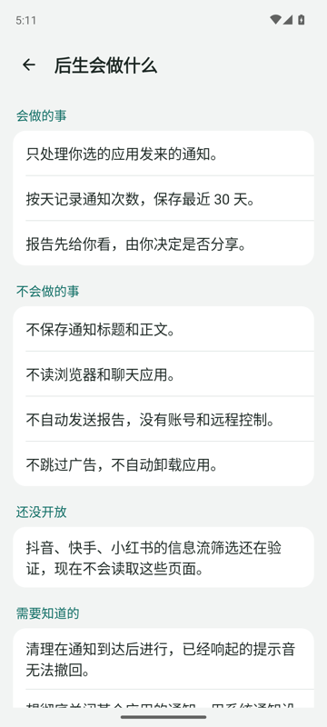
</p>

### 为长辈设计

- 正文 18sp，按钮和主要控件高 60dp，对比度都在 4.5:1 以上。
- 跟随系统字号。字号超过 130% 时，标签和数值改为上下排列，不会一个字一行。
- 状态不只靠颜色区分，灰度下也能分辨。
- 版式和系统设置一致：分组列表，整行可点，← 返回。

参考了 Material 3、Apple HIG 和工信部《移动互联网应用（APP）适老化通用设计规范》。完整规则、设计稿和实机截图见 [界面规范](design/ui/README.md)。

<p align="center">
  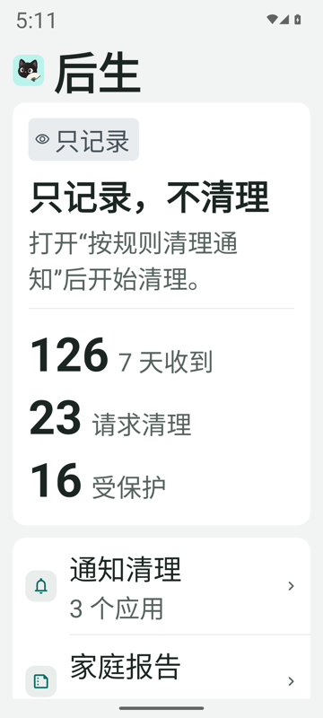
  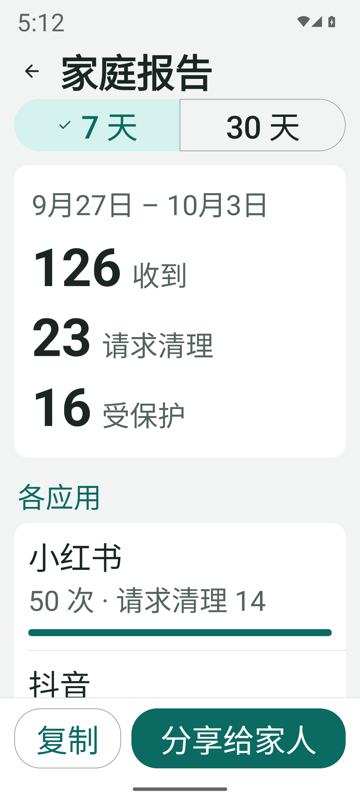
</p>

截图来自 Android 13 模拟器，数字是演示数据。

> [!NOTE]
> 调试预览版新增**小红书 9.49.0 发现页标题筛选**，需单独确认开启，命中卡片可遮挡并恢复。抖音、快手尚未开放，视频画面识别未实现。见 [模型与真机验证](docs/clef-validation.md)。

## 安装

需要 Android 11 或以上。当前下载提供 Clef 调试预览包，供家人验证使用。

1. 打开 [发行版页面](https://github.com/PathGao/housheng/releases)，下载 `housheng-<版本>.apk`，可用同页的 `SHA256SUMS` 校验。
2. 打开后生，在首页点“去系统设置允许”，授予通知使用权。
3. 在“通知清理”里选要管理的应用。先保持“按规则清理通知”关闭，观察几天次数。
4. 和家人一起看“家庭报告”，定好关键词和放行来源，再开启清理。

日常使用**不需要无障碍权限**。清理发生在通知到达之后，已经响过的声音或弹过的横幅仍会出现。想彻底关掉某个应用的通知，用后生里的“系统通知设置”入口。

> [!WARNING]
> 装过 CI 或本机调试包的手机，签名与发行版不同，无法直接覆盖安装。需要先卸载旧版，本机记录会清空。详见 [发版流程](docs/releasing.md)。

## 隐私

- **通知在本机处理。** 标准 release 构建没有网络权限。当前 Clef 调试预览包有网络权限，只有主动开启的信息流筛选会调用 Cloudflare。
- **只看你勾选的应用。** 浏览器、聊天和名单外应用一概不采集。
- **不存正文。** 通知标题和正文不落盘，本机只留最近 30 天的次数汇总。
- **报告不自动发送。** 报告不含正文、验证码或私聊，由爸妈预览后自己分享。
- **现在没有账号。** 无远程控制，无同步。调试版可主动启用 Clef API，单独开启小红书时只发送公开卡片标题，凭据由本人配置并在手机加密保存。
- **后续 AI 设置单独开启。** 提示词整理和孩子账号同步尚在规划，发送范围和授权要求见 [路线图](docs/roadmap.md#ai-与联网)。
- **不越权。** 不屏蔽广告，不点“跳过”，不绕过应用限制，不自动卸载。

完整的数据范围、权限和统计口径见 [应用范围与隐私](docs/app-scope.md)。

## 接下来

先让真实信息流筛选又快又准，并能一键纠正误筛。稳定后再支持年轻人自己用：

- **质量筛选**：少看标题党和没依据的绝对承诺。可用滑块调宽严，也可用自己的话写提示词。
- **拓展视野**：给不常接触的话题和来源留点时间。
- **临时回避**：今天不想看某类内容，到期自动恢复。
- **内容解说**：保留观看，同时说明哪里值得核实。
- **家人远程帮忙**：父母同意后，孩子账号可以远程调整父母手机上的质量滑块和提示词，每次修改父母都看得到、能撤销。

以上均未实现。规则由本人设定和解除，付费不能买放行。进度与验收条件见 [路线图](docs/roadmap.md)。

## 参与开发

需要 JDK 17 和 Android SDK 35，Gradle 用仓库自带的 Wrapper。

```sh
./gradlew :app:testDebugUnitTest :app:lintDebug :app:assembleDebug
```

调试包在 `app/build/outputs/apk/debug/app-debug.apk`。CI 会跑单元测试、Lint、调试与发行构建，并检查发行版没有网络权限。

| 目录 / 文档 | 内容 |
|---|---|
| `app/` | 主程序：通知清理、家庭报告、应用清单 |
| `fixture/` | 合成验证场，测试翻页与保护边界 |
| `validation/clef/` | Clef 手机直连、USB 对照与固定样本评估，见 [说明](validation/clef/README.md) |
| [开发入口](docs/development.md) | 本机构建、真实应用验证与清理范围 |
| [设备验证](docs/device-validation.md) | 真机测试步骤与结果，入口 `scripts/test-device.sh` |
| [界面设计](docs/product-design.md) | 家庭版页面与适老取舍 |
| [界面规范](design/ui/README.md) | 颜色、字号、组件、文案规则，附设计稿与实机截图 |
| [发版流程](docs/releasing.md) | 签名、打标签、发布 APK |
| [图标](design/icon/README.md) | 黑猫折扇图标来源与启动器配置 |

反馈问题请在 [Issues](https://github.com/PathGao/housheng/issues) 附上手机型号、Android 版本、操作步骤和首页显示的服务状态。截图前请遮挡个人信息，不需要提供真实通知正文。
