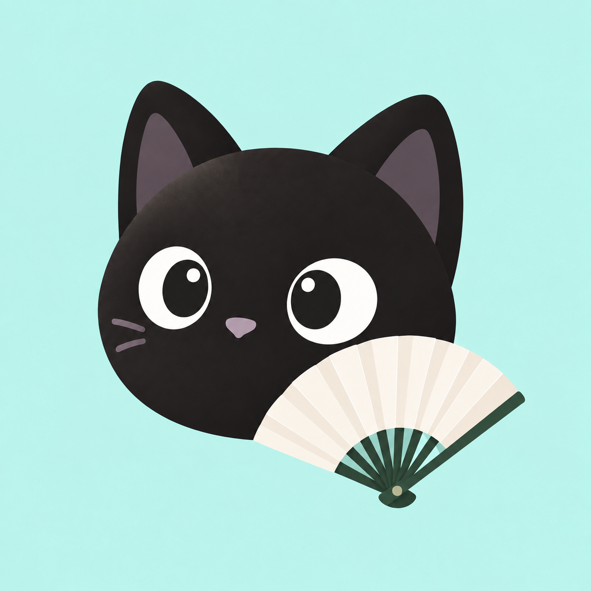

# 后生应用图标

2026-10-03 用户选定：青色背景、黑猫头像、米白素面折扇。以原始扇畔小生图为底稿，仅去除竹竿和竹叶图案，保留原扇骨、折痕和覆盖比例。

原稿即 Android 使用的 PNG，只有一份。自适应图标通过原生 Drawable 留出裁切边距，不重绘原图，不预切圆角。前景与背景配置见 `app/src/main/res/mipmap-anydpi/ic_launcher.xml`。

`housheng-rounded.png`（512×512，圆角半径 22.37%，透明角）只用于 README 和商店展示。启动器图标仍走自适应图标，圆角由系统裁切。

图像由内置图像生成工具制作。最终编辑提示：只去除扇面竹竿与竹叶，保留猫、青色背景、原扇骨、折痕和扇面比例。

未选候选图与中间修订稿已移至源码目录之外的本地笔记归档。历史提交仍可恢复最初探索稿。
