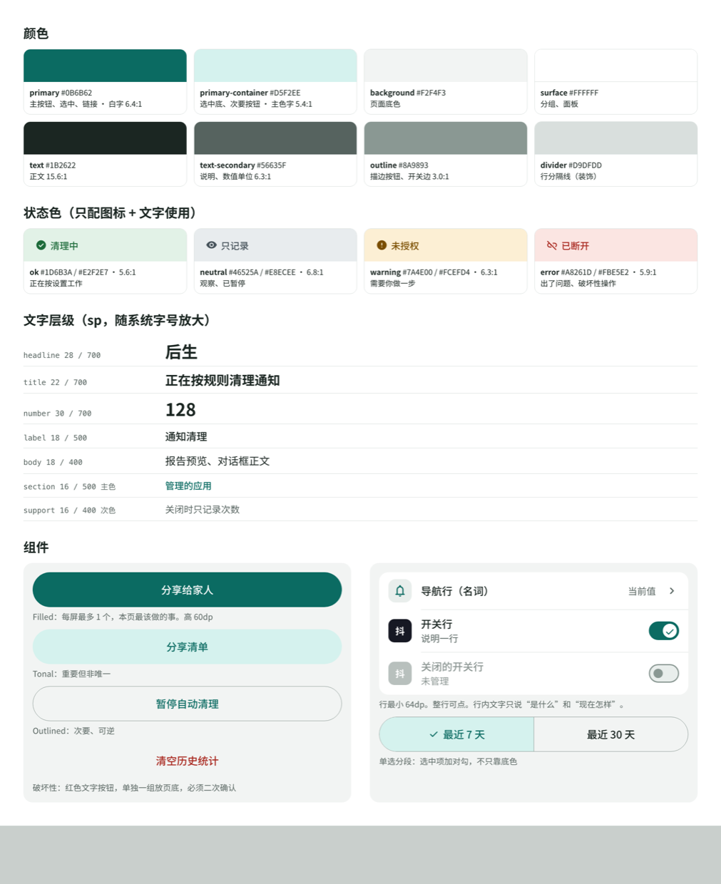
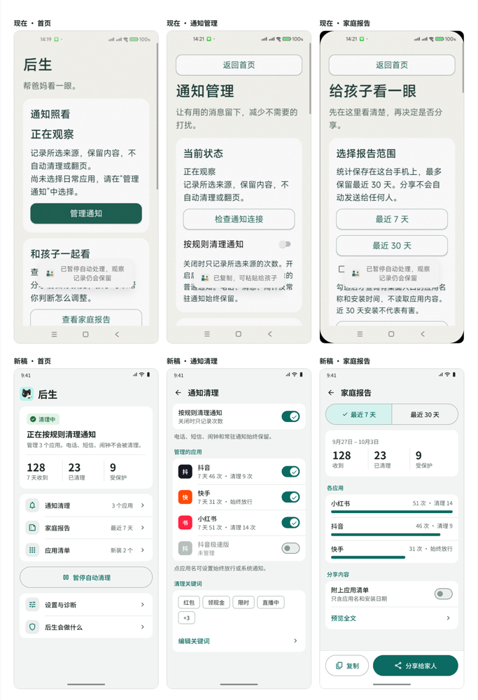
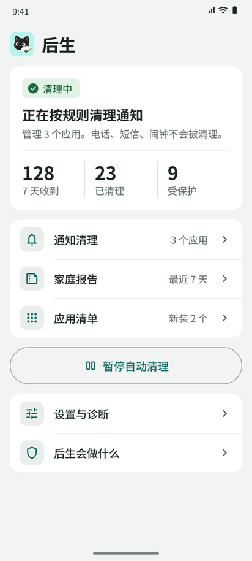
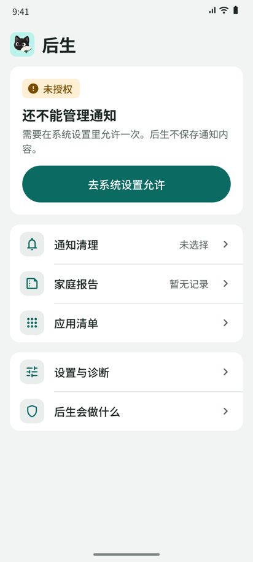
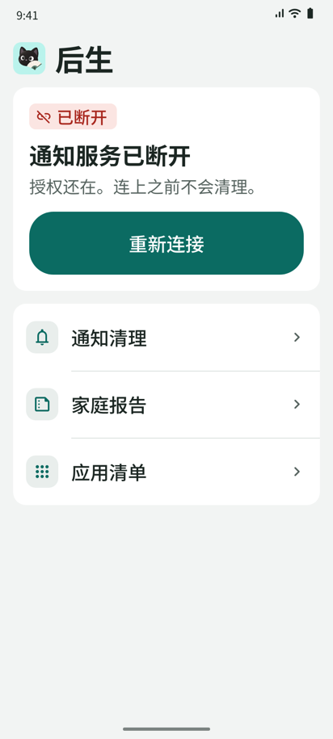
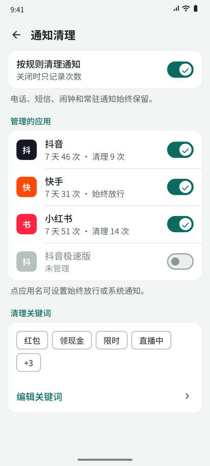
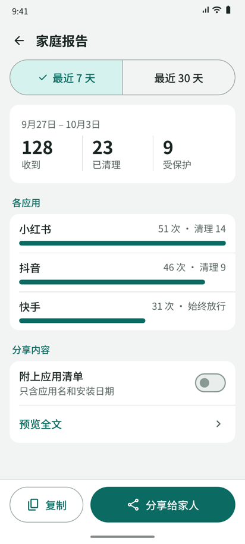
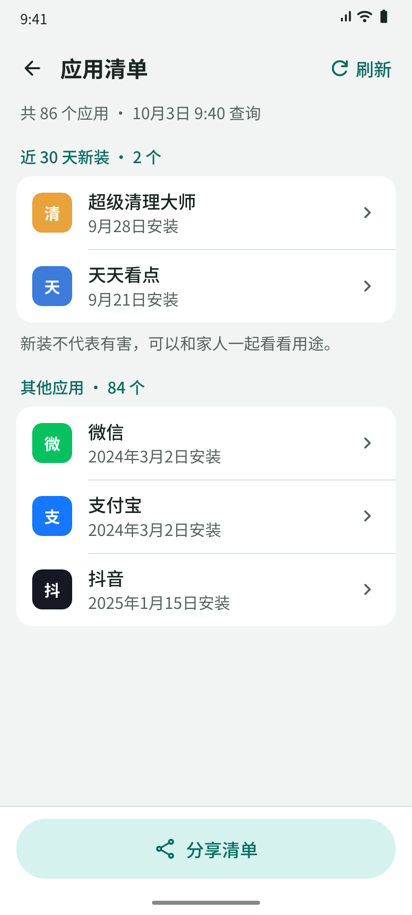

# 后生界面规范

2026-10-03 确认并实现。组件在 `ProductUi.kt`，颜色在 `colors.xml`。页面分工见 [界面设计](../../docs/product-design.md)。设计稿与实机截图在本文末尾。

## 依据

| 来源 | 采用 | 不采用 |
|---|---|---|
| Material 3、Android 无障碍指南 | 颜色角色、sp 字号、48dp 触控下限、列表行结构、按钮层级、开关即时生效 | 默认 14–16sp 正文（对父母偏小） |
| Apple HIG | 分组列表 + 分区脚注放说明、行尾 › 表示可进入、弹窗写法、权限在用到时才要 | iOS 控件外观 |
| 工信部《APP 适老化通用设计规范》 | 主要文字 ≥18、主要控件 ≥60dp、行距 ≥1.3、对比度 ≥4.5:1、颜色不单独传意、弹窗关闭易点 | — |
| UI UX Pro Max（Senior Care） | 大字、平静配色、状态不只靠颜色 | 网页字体、落地页结构、转化按钮 |

## 设计原则

1. 用户以为自己在用系统设置。版式跟 Android 设置页一致：分组列表、整行可点、行尾箭头或开关。
2. 每屏先回答“现在怎样”，再给“能做什么”。状态在最上，操作在下。
3. 一种信息只用一种样式。状态、数值、操作、说明各有固定外观，见下表。
4. 说明放在分组下方，一组最多一句。隐私和边界说明集中在“后生会做什么”页，不在每页重复。
5. 一屏最多一个实心主按钮。破坏性操作单独成组放页底，二次确认。

## 信息类型与样式

| 类型 | 样式 | 示例 | 禁止 |
|---|---|---|---|
| 页面标题 | 顶栏 title 22 | 通知清理 | 口号、副标题 |
| 状态 | 状态标签（图标 + 词 + 底色）+ 一句 title | 清理中 / 正在按规则清理通知 | 只用颜色，用正文段落描述状态 |
| 数值 | number 30 + support 标签 | 128 · 7 天收到 | 把数字写进句子里，把清理请求写成“已清理” |
| 分区 | section 16 主色 | 管理的应用 | 用卡片标题代替 |
| 设置项 | 行：label 18 + support 16 + 开关 | 按规则清理通知 / 关闭时只记录次数 | 开关加“保存”按钮 |
| 导航 | 行：label 18 + 当前值 + › | 应用清单 · 新装 2 个 | 用大按钮做页面入口 |
| 操作 | 按钮，动词开头，≤6 字 | 分享给家人 | “返回首页”按钮（用顶栏 ←） |
| 说明 | support 16 次色，分组下方一句 | 电话、短信、闹钟始终保留。 | 多段免责声明 |
| 反馈 | 状态原位更新；复制等瞬时结果可用 Toast | 已复制 | 用 Toast 传达重要状态 |

## 状态词表

服务状态只用这几个词，标签与 `ServiceStatus` 一一对应。

| 状态 | 标签 | 图标 | 颜色 | 标题 | 首页按钮 |
|---|---|---|---|---|---|
| 未授权 | 未授权 | error | warning | 还不能清理通知 | 去系统设置允许 |
| 已授权未连接 | 已断开 | link_off | error | 通知服务已断开 | 重新连接 |
| 观察 | 只记录 | visibility | neutral | 只记录，不清理 | 无 |
| 执行 | 清理中 | check_circle | ok | 正在按规则清理通知 | 暂停自动清理（描边） |

## 颜色

固定浅色主题。对比度已按 WCAG 公式计算。

| 角色 | 值 | 用途 | 对比度 |
|---|---|---|---|
| primary / on-primary | #0B6B62 / #FFFFFF | 主按钮、选中、可点文字 | 6.4:1 |
| primary-container | #D5F2EE | 选中底、tonal 按钮 | 主色字 5.4:1 |
| background | #F2F4F3 | 页面底 | — |
| surface | #FFFFFF | 分组、面板 | — |
| text | #1B2622 | 正文 | 15.6:1 |
| text-secondary | #56635F | 说明、数值标签 | 6.3:1 |
| outline | #8A9893 | 描边按钮、关闭态开关 | 3.0:1 |
| divider | #D9DFDD | 行分隔线 | 装饰用 |
| ok | #1D6B3A on #E2F2E7 | 清理中 | 5.6:1 |
| neutral | #46525A on #E8ECEE | 只记录、已暂停 | 6.8:1 |
| warning | #7A4E00 on #FCEFD4 | 需要用户做一步 | 6.3:1 |
| error | #A8261D on #FBE5E2 | 已断开、破坏性操作 | 5.9:1 |

状态色只用于状态标签和破坏性操作，必须同时有图标和文字。品牌青色 #B9F2EC 只用于启动图标。

## 文字

系统字体（中文 Noto Sans CJK / 厂商字体），不内置字体。字号用 sp，随系统字号放大。行距 1.3–1.5。

| 层级 | 字号 / 字重 | 用途 |
|---|---|---|
| headline | 28 / Bold | 首页“后生” |
| title | 22 / Bold | 顶栏标题、状态标题 |
| number | 30 / Bold，等宽数字 | 统计数值 |
| label | 18 / Medium | 行标题、按钮 |
| body | 18 / Regular | 对话框正文、报告全文 |
| section | 16 / Medium，主色 | 分区标题 |
| support | 16 / Regular，次色 | 行副文本、分组说明 |

不出现小于 16sp 的文字。

## 尺寸

4dp 网格。页面左右 16dp，屏宽 600dp 以上至少 48dp，内容最宽 840dp，底部操作栏同样对齐。分组之间 16dp，分区标题上 20dp 下 8dp。

| 元素 | 规格 |
|---|---|
| 按钮、分段选择 | 高 ≥60dp，全圆角 |
| 列表行 | 最小高 64dp，左右 16dp，元素间距 16dp；不写死高度 |
| 行首图标 | 40dp 方块，圆角 12dp，内图标 24dp |
| 开关 | 52×32dp，整行可点 |
| 顶栏 | 64dp，← 返回 48dp 触控区，内容描述“返回” |
| 圆角 | 分组与面板 16dp，状态标签 8dp |
| 底部操作栏 | 白底，上分隔线，放本页主操作 |

## 组件

1. 按钮层级：实心 > tonal > 描边 > 文字。实心每屏最多 1 个。破坏性用红色文字按钮，单独成组放页底。
2. 分段选择：用于 7 天 / 30 天这种二选一，选项文字尽量短。选中项加 ✓，不只靠底色。
3. 开关：拨动即生效，不配保存按钮。关闭的行文字变灰，副文本写明“未管理”。
4. 对话框：只用于授权说明和破坏性确认。标题写发生什么，按钮写动作（“清空记录”/“保留”），不用“确定/是/否”。取消在左，确认在右。
5. 空状态：一句说明 + 一个能做的事。示例：“还没有记录。选好应用后开始统计。”
6. 图标：Material Symbols Rounded，用 `scripts/material-icon.sh` 导出为 VectorDrawable，不加依赖。图标不单独表意，旁边必须有文字。按钮不带图标。
7. 大字号：系统字号超过 130% 时，行内的值移到标签下方，数值区和底部操作栏按钮改为上下排列，避免标签按字断行。

## 文案

1. 写事实，不写情绪和口号。不用“帮爸妈看一眼”“照看”这类话。
2. 称呼用“你”。对象用“家人”，不写死“孩子”“爸妈”。
3. 行标题用名词，按钮用动词。避免“管理、设置、更改”这类泛动词做标题。
4. 一句话说一件事，说明最多一句。不写“不代表”“仅供”等防御性句子，必要的边界写进“后生会做什么”页。
5. 数字用阿拉伯数字加单位，数字与单位之间空格：“3 个应用”“7 天”。
6. 标签、按钮、状态词不加句号。说明句加句号。

## 验收

1. 系统字号最大档下所有页面不截断、不重叠。
2. TalkBack 能读出状态标签全文、开关名称与开关状态、返回按钮。
3. 每屏实心按钮不超过 1 个。
4. 颜色关掉（灰度截图）后状态仍可分辨。

## 设计稿

确认方向时的 HTML 稿，源文件 [mockups/mockups.html](mockups/mockups.html)，用 `?s=home` 等参数切换页面。数值是示意，个别文案在实现时按上文调整，以实机截图为准。

| 首页 | 未授权 | 已断开，字号 1.3 倍 |
|---|---|---|
|  |  |  |

| 通知清理 | 家庭报告 | 应用清单 |
|---|---|---|
|  |  |  |

## 实机截图

2026-10-03，Android 13 模拟器，演示数据。

| 首页 | 未授权 | 通知清理 | 通知清理下半 |
|---|---|---|---|
|  |  |  |  |

| 单个应用 | 家庭报告 | 家庭报告下半 | 应用清单 |
|---|---|---|---|
|  |  |  |  |

| 后生会做什么 | 首页，字号 200% | 家庭报告，字号 200% |
|---|---|---|
|  |  |  |
